# Keepsimplebooks
## Simple book keeping app for generating balance sheets and P/L statements

This app allows you to easily organise all your expenses. You set the categories and tags once, then upload your transactions as needed.

Obviously, all the transactions amounts and names below have been altered for this demonstration.

### Upload transactions


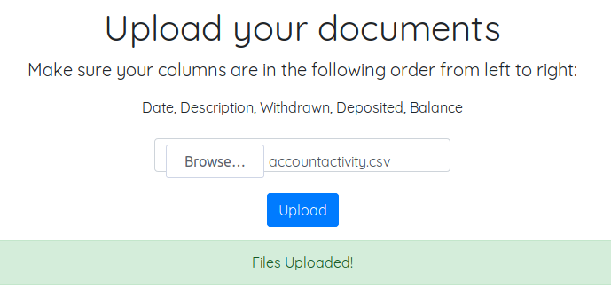

Navigate to the 'Transactions' page.

### Start by adding a category


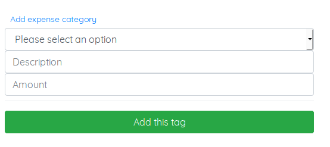

Once the category is added, it will be automatically selected.

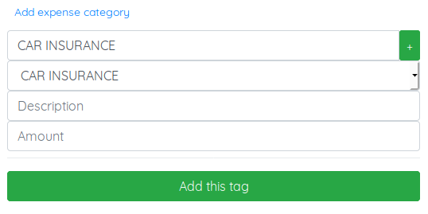


### Tag a transaction that you want sorted under that category


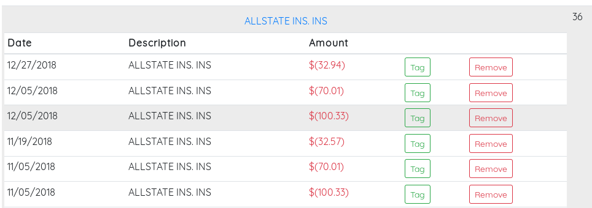

You can see we have lots of recurring transactions from Allstate insurance, for an overhead view of our books this is useless. Let's get these 36
transactions cleaned up.
Since we added the category 'Car Insurance', we'll get those ones tagged first.

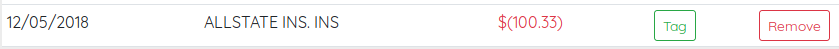

Click the 'Tag' button next to the transaction.
The transaction details are automatically populated to the tag form and the user is given a description of how the tag will function.

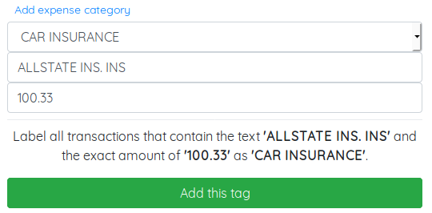

Since we have also have home insurance with the same company, we don't want to track this transaction by only the company name, but the name and
amount for the best accuracy.
Click 'Add this tag'.

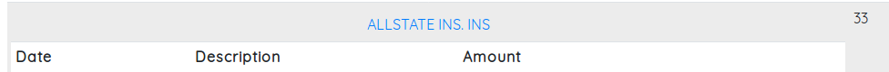

You can see that 3 transactions have been removed from the Allstate Ins. Ins heading.
My auto insurance premium decreased that year, so another tag is needed to catch the different price

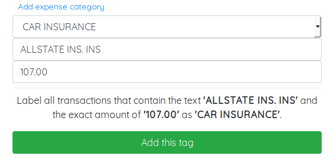

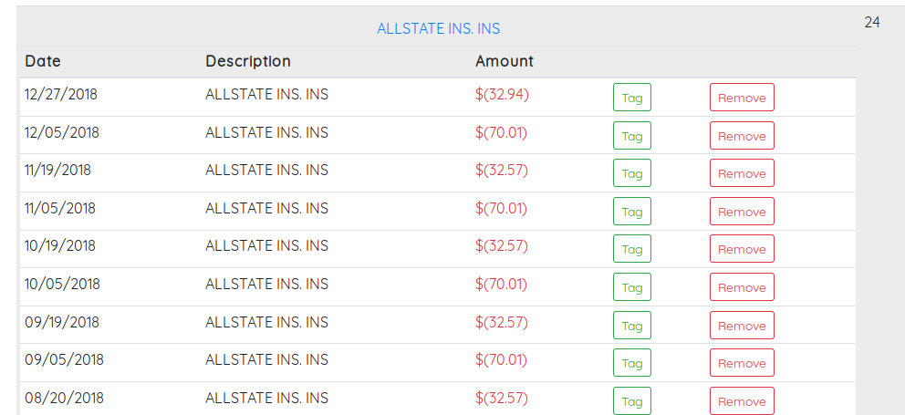

After adding these tags, I've removed all the car insurance payments from this section. The number of transactions has decreased from 36 to 24 in
less than 2 minutes. The remaining transactions are for home insurance, which took another minute to add the appropriate tags for.

### Tagging by description


If you have recurring deposits, or withdrawls that always contain the same set of words but the amounts are typically different you are able to tag
the transaction by a substring.

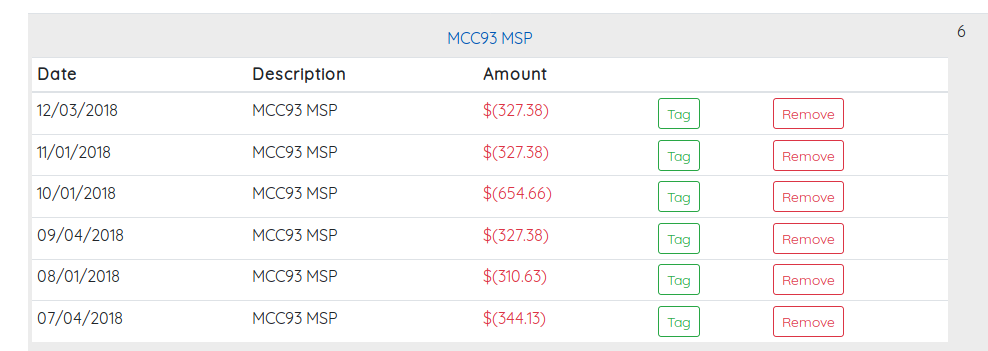

I pay condo fee's each month, and sometimes the amounts are not always the same. Since the transaction name is always the same
it makes sense to tag the transaction by the description only, and not worry about the amount.

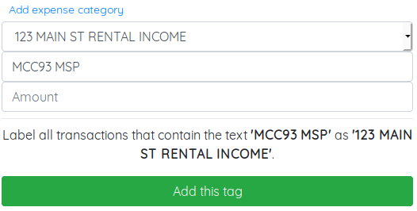


Another situation common situation is to have a recurring transaction, but a unique transaction # prepended to each transaction description.

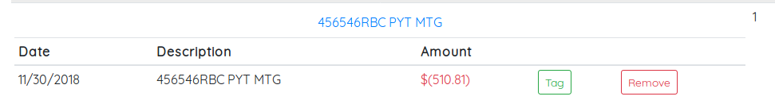

I know for a fact that I have 12 mortgage payments per year, but there is only one in this column. This is because the transaction was processed with the
banks transaction #.

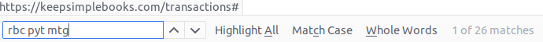

There are clearly many more mortgage payment transactions on the page, than were organised into this section. The easiest thing to do is just track the
substring 'RBC PYT MTG' and let the app deal with the rest.

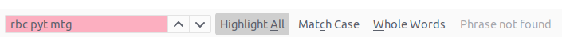

After adding the tag, you can see it's been handled.

### One time transactions


One time transactions can be tracked by simply tagging the exact name and amount of the transactions under your preferred category.
If you'd prefer to not track the transaction, you can double click the 'remove' button next to the transaction and it will be deleted from the database.

### Getting the net value


You can also get the net gain or loss if you tag withdrawl transactions and deposit transactions under the same category.

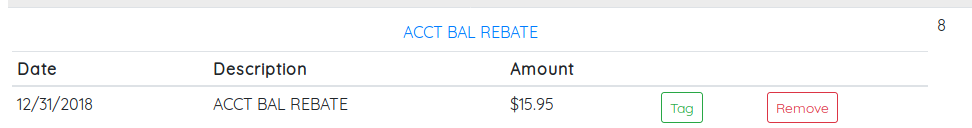

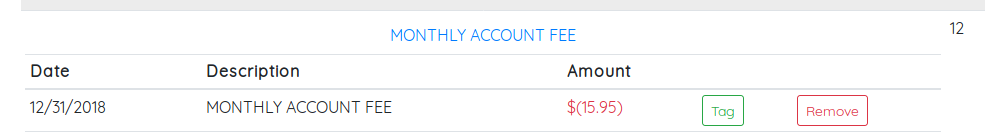

I've got a monthly banking fee that is rebated back into my account almost every month. You can see I've got 8 rebates, and 12 charges for the same amount.
I'll create a category called 'Acct Fee', and tag the rebates as well as the withdrawls under this category. This will let me know whether
I am breaking even or not. In this specific situation obviously from 8 rebates and 12 charges I have not broke even, but there are more complicated
situations that this is useful.

In the case of a rental property, you can tag the related transactions (rental income, mortgage, property tax, condo fee, renovations, etc...) and
see what the net gain or loss is of that property very quickly.

After navigating to the dashboard page you can view your generated balance sheet.
|### Balance Sheet|### P/L Statement|
|---|---|
|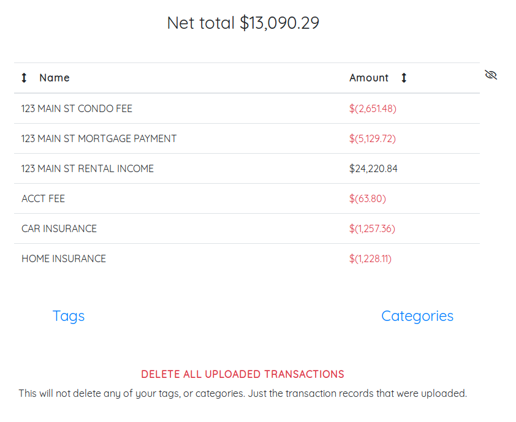|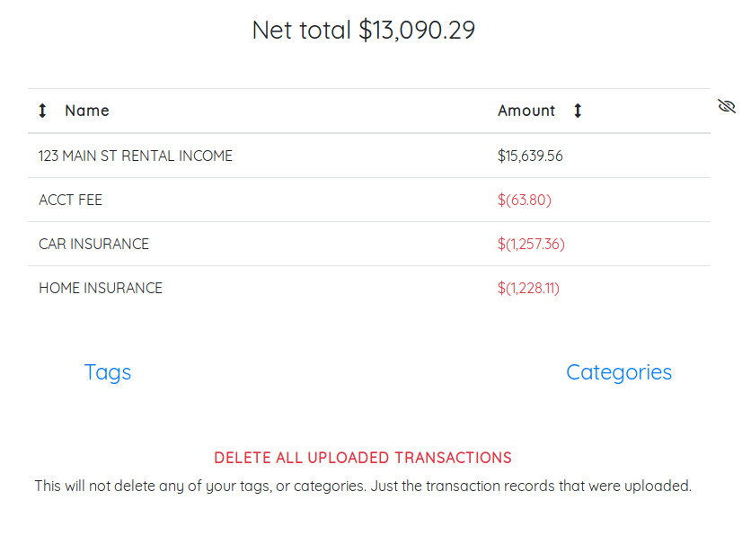|
|An easy to read balance sheet is generated.|Since I tagged the condo fee's, mortgage payments, and all other associated costs and income I have effectively generated a Profit and Loss statement
for this rental property.|


```
Note: There is no setting to select whether you want a P/L statement or Balance Sheet.
I am simply referring to the way that I organized the transactions under the category
'123 Main St Rental Income'. Since I lumped all the expenses into that category with the
income, the effective result is a P/l Statement. The only difference is creating extra
categories for the condo fee's and mortgage payments just gives you a balance sheet.
```

### Deleting transactions


You can navigate to the dashboard, click the red text 'DELETE ALL UPLOADED TRANSACTIONS' and then confirm by clicking the 'Delete' button.
This will save all of your tags and categories, allowing you to create a balance sheet or p/l statement, print it off or save it.
e.g.
You upload a bank statement for January, set all the tags and categories but don't want to keep your financial info online so you delete the transactions.
Next month, at the end of February you can upload the statement again and without doing any work you'll have an already generated balance sheet.

### Deleting categories and tags


You can delete categories and tags by expanding either section on the dashboard page and clicking the 'remove' button next to the name.
